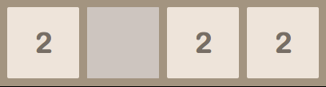
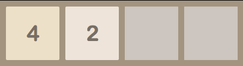

#Merge

##Introduction
For this assignment, you will implement a function merge(line) that models the process of merging all of the tile values in a single row or column. This function takes the list line as a parameter and returns a new list with the tile values from line slid towards the front of the list and merged. Note that you should return a new list and you should not modify the input list. This is one of the more challenging parts of implementing the game.

##Notes
In this function, you are always sliding the values in the list towards the front of the list (the list position with index 0). You will make sure you order the entries in line appropriately when you call this function later in the next assignment. Empty grid squares with no displayed value will be assigned a value of zero in our representation.

For example, if a row of the board started as follows:

And you slide the tiles left, the row would become:

1. Note that the two leftmost tiles merged to become a 4 and the third 2 just slides over next to the 4.

* A given tile can only merge once on any given turn, although many pairs of tiles could merge on a single turn.

* For the above example, the input to the merge function would be the list [2, 0, 2, 2]. The function should then produce the output [4, 2, 0, 0]. We suggest you begin to implement this function as follows:

* Start with a result list that contains the same number of 0's as the length of the line argument.
Iterate over the line input looking for non-zero entries. For each non-zero entry, put the value into the next available entry of the result list (starting at position 0).
Notice if you only follow this process, you would end up with the result [2, 2, 2, 0].

* Now you should think through what you should add to your function in order to merge tiles. Keep in mind, however, that any tile should only be merged once and that these merges should happen in order from lowest index to highest index. For instance, on the input [2, 0, 2, 4], the result should be [4, 4, 0, 0], not [8, 0, 0, 0].

* Note that there are many ways to implement the merge function. The objective of this project is for you to use what you've learned in our previous classes to implement a complex function. You have already learned all of the Python required to implement merge, so the challenge is to think carefully about what the function does and how to best accomplish that.

##Here is one basic strategy to implement the merge function:

* Iterate over the input and create an output list that has all of the non-zero tiles slid over to the beginning of the list with the appropriate number of zeroes at the end of the list.
* Iterate over the list created in the previous step and create another new list in which pairs of tiles in the first list are replaced with a tile of twice the value and a zero tile.
* Repeat step one using the list created in step two to slide the tiles to the beginning of the list again.

This is not the most efficient way of implementing merge. While it is fine to implement it in this way, we challenge you to think of other ways of doing it that do not require creating so many lists. Ultimately, how you approach the problem is up to you.
